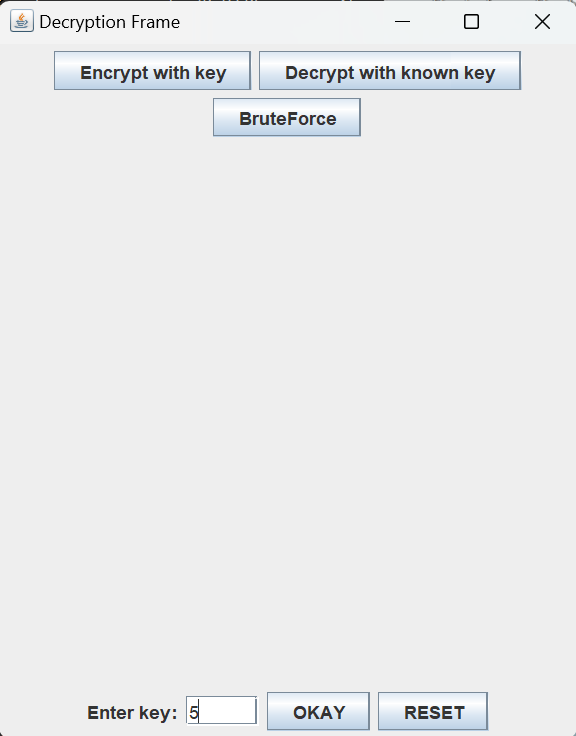

# CaesarCipher3.0
Decrypt, encrypt and bruteforce texts written with slavic/cyrillic letters with GUI.

## What does this git do?

It helps to encrypt and decrypt the text written in Russian according to the principle of the Caesar cipher.
The project also presents a way to obtain a key using brute force (brute force method).
